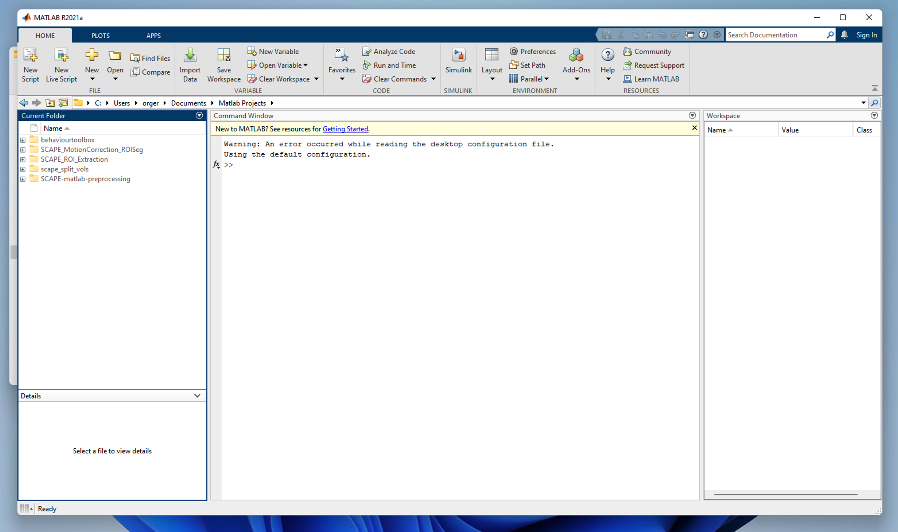

# How to preprocess

## Data Structure

Data Structure from the moved behavioural rig set-ups.

```
.
└── Batch1
    ├── SRRM3_Seizure
    │   ├── SRRM3_Seizure_atlas_20210706_1917
    │       ├── SRRM3_Seizure_atlas_20210706_1917_000_camlog.txt
    │       ├── SRRM3_Seizure_atlas_20210706_1917_arduinolog.txt
    │       ├── SRRM3_Seizure_atlas_20210706_1917_info.txt
    │       ├── SRRM3_Seizure_atlas_20210706_1917_stimlog.txt
    │       └── console_log_2021_07_06_19_17_14.txt
    │   └── SRRM3_Seizures_c3po_20210706_1918
    │       └── ...
    │       ├── ...
    │       └── ...
    └── SRRM3_Seizures_camlogconfig.txt
```
**Batch1** is the root directory and will be assigned as `data_folder` in the script.
**SRRM3_Seizure** is the experiment name and will be assigned as `protocol_name` in the script.

## Steps
1.  Clone the [BehaviourToolBox](https://bitbucket.org/fchampalimaud/behaviourtoolbox/src/master/) repo from Bitbucket. Make sure you have also cloned the code mike [repo](https://bitbucket.org/fchampalimaud/bout_detection_and_classification/src/master/) inside
```bash
git clone git@bitbucket.org:fchampalimaud/behaviourtoolbox.git
```
2.  Open Matlab

3.  Navigate through the current folder panel into you the BehaviourToolBox folder directory.
4.  Right click `matlab_converter` directory and "Add to Path" `Selected Folders and Subolders`.

5.  Then enter `code-mike` directory in the Current Folder panel. Then "Add to Path" `Mike_FreelyMovingBehaviourAnalysis`.
6.  Enter the `matlab_convert` directory and open the script `main_preprocessing.m`

7.  The variable `data_folder` is the root directory path which will contain all of your experiment (fish) folders.
8.  The variable `protocol_name` is the name of your experiment and is seen in all the datafiles.
9.  Run the first section


10. Run the camlog section
11. Run the bout log section
>Note: if it crashes due to diensions, check if there is an error when joining matrix of failed start and end bouts

12. Before running the stimlog section, open the stimuli player application. Note information to install this is on the wiki

13. Run the stim log section


