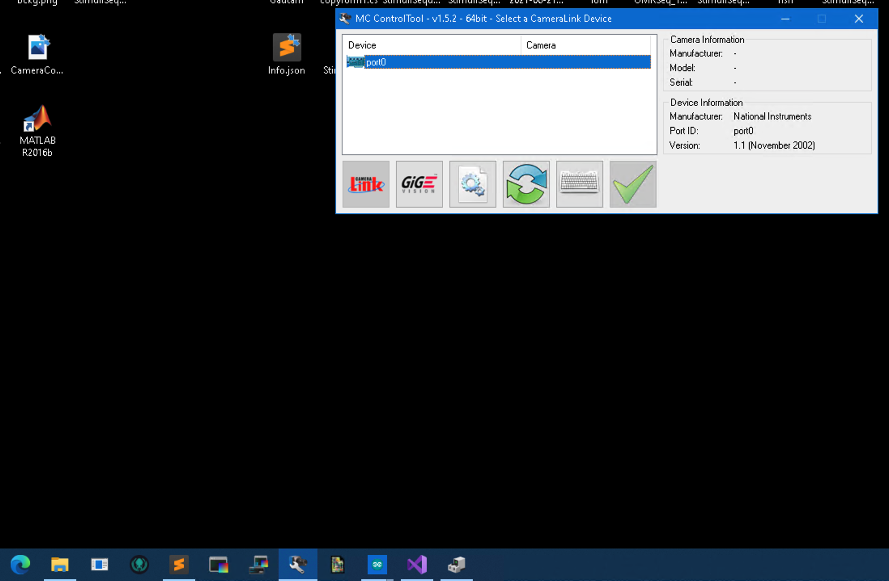
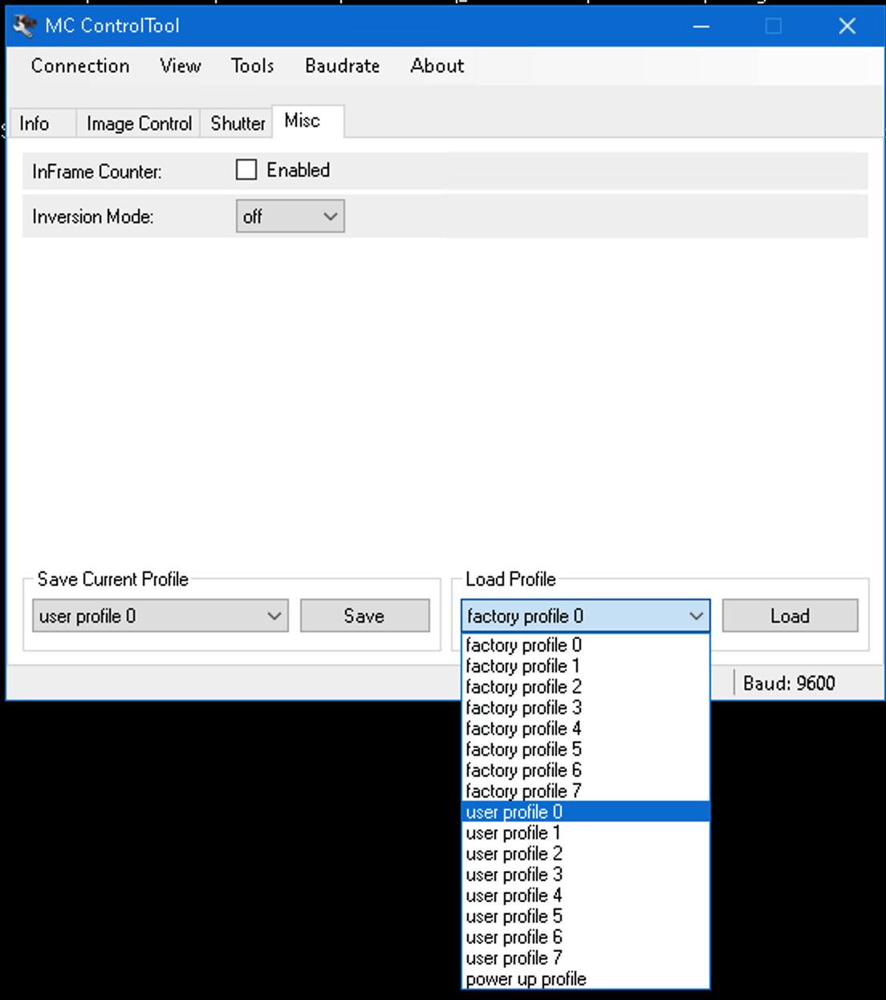
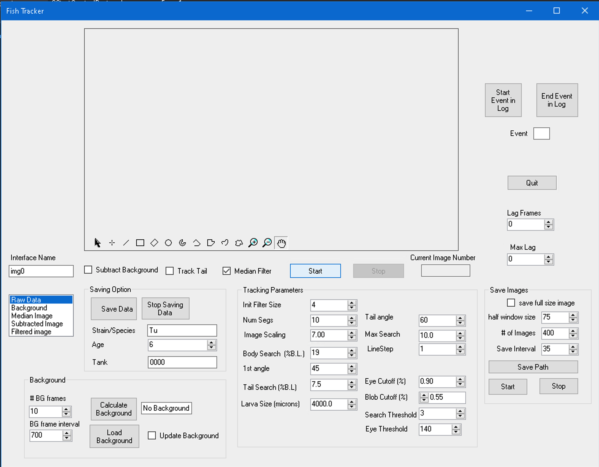
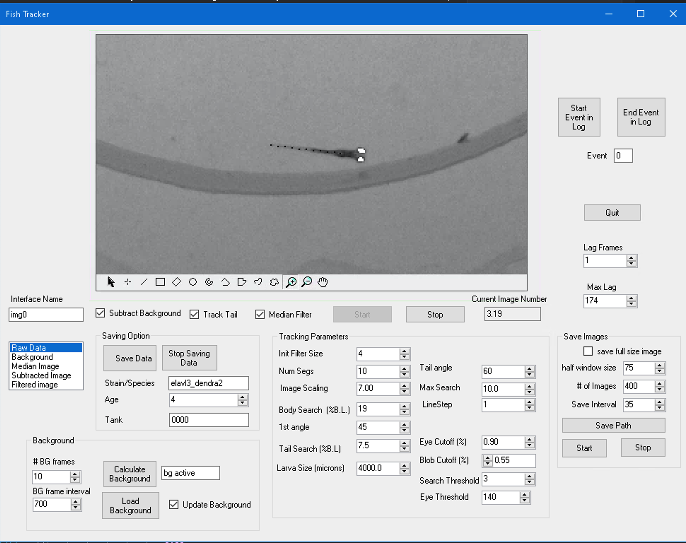
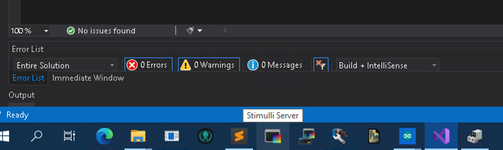
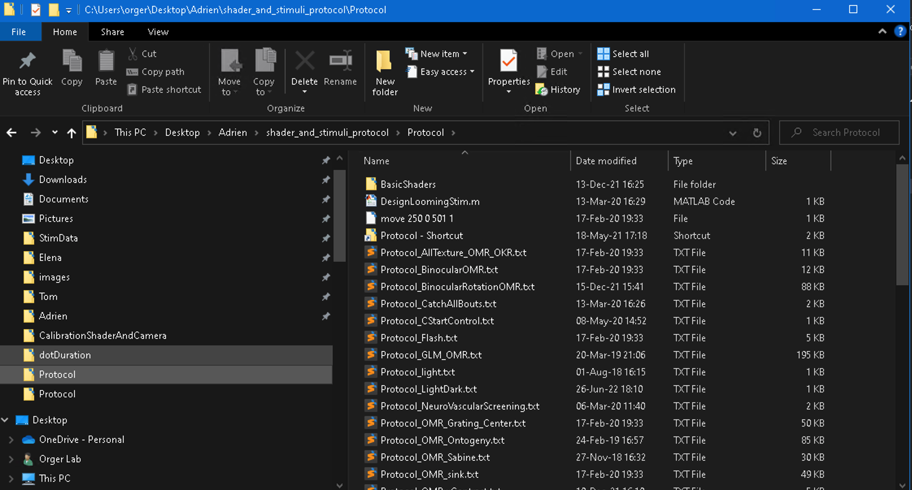
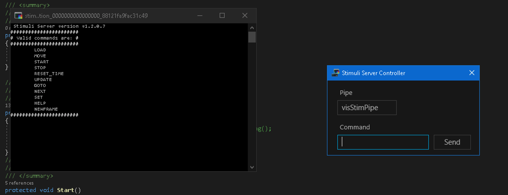
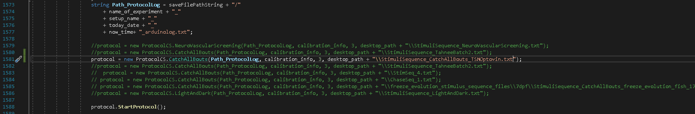
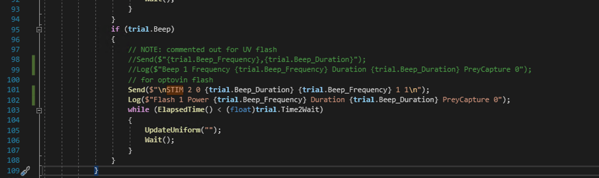

# Behavioural Rig Start-up

This will show the steps in order to run a zebrafish protocol using the z-tracket pipeline.

1. Check that the project, fan, arduino and computer are plugged in.
2. Switch on the projector and turn on the fan dial
3. Open the application `MC Control Tools` and double click Port 0

1. Go to the Misc tab then load profile `user profile 0`. To see if you have maximised the camera frame rate go to the shutter tab and see that the 700 fps is selected.

1. Open up the behavioural tracking software e.g. `C:\Users\orger\Desktop\Tom\Adriens_pipeline\z_tracker\Tracker` double click `FishTracker.sln`.
2. Fill up the arena with E3 solution using a pipette with a filter attached to the end.
   1. Making E3 solution 16.7ml of 60x E3 solution (normally found top shelf above sink in behavioural room) followed by 1L water.
3. Start the `.sln`
4. Click start on the panel to switch on the camera. 
5. Click calculate the background, then subtract the background from the fish by clicking update background.
6.  Make sure the background has correctly subtracted, by ticking `Subtract Background` box and `Tail Tracking` then selecting the `Subtracted Image` option on the far right of the panel. If subtracted correctly return to the `raw data` view, otherwise recalculate the background and update.
7.  Fill in the meta data about the experiment. 
8.  Open Stimuli server (this is to pair the shader with the project screen).
9.  Open up the `Stimuli Server Controller`. You should load the shader protocol, this should be in the directory `C:\Users\orger\Desktop\Adrien\shader_and_stimuli_protocol\Protocol\Protocol_CatchAllBouts.txt`.
10. Then Open sublime and look for a file with a command `move 505 143 403 1` (the number will be different for each set-up). Enter this command into the stimuli controller panel 


There are two main files `Form1.cs` and `CatchAllBoutsProtocol.cs`

To map your stimulus protocol with the behavioural code you need to open the `Form1.cs` and provide the name of your stimulus sequence filename (note this must be saved in the desktop).


An example stimulus sequence would be:
```
UniformLight	UniformLight_Color	ForwardOMR	ForwardOMR_Speed	RotationOMR	RotationOMR_Speed	RotationOMR_Direction	ApproachingDot	ApproachingDot_Direction	LoomingDot	LoomingDot_Direction	Beep	Beep_Frequency	Beep_Duration	Time2Wait
1	1	0	0	0	0	0	0	0	0	0	0	0	0	6000
0	0	0	0	0	0	0	1	88	0	0	0	0	0	4000
1	1	0	0	0	0	0	0	0	0	0	0	0	0	10000
0	0	0	0	0	0	0	1	266	0	0	0	0	0	5000
1	1	0	0	0	0	0	0	0	0	0	0	0	0	10000
0	0	0	0	0	0	0	1	273	0	0	0	0	0	9000
1	1	0	0	0	0	0	0	0	0	0	0	0	0	10000
0	0	0	0	0	0	0	1	90	0	0	0	0	0	14000
1	1	0	0	0	0	0	0	0	0	0	0	0	0	10000
```

For the case where you want to use a UV flash rather than the beep stimuli. Open `CatchAllBoutsProtocol.cs` and comment out `Send($"{trial.Beep_Frequency},{trial.Beep_Duration}");` and instead enter `Send($"STIM 2 0 {trial.Beep_Duration} {trial.Beep_Frequency} 1 1");`. This will be the alternative command sent to the arduino.
