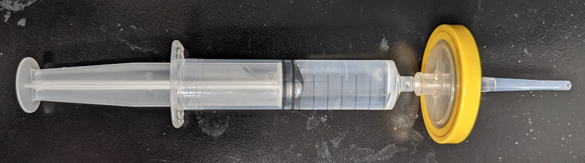

# Behavioural Rig Start-up

This will show the steps in order to run a zebrafish protocol using the z-tracket pipeline.

1. Plan and save you protocol [click here for details/example](##Before-running-experiments).
2. Fill up the arena with E3 solution using a pipette with a filter attached to the end [click here for details](##Arena-preparation).

3. Check that the project, fan, arduino and computer are plugged in.
4. Switch on the projector and turn on the fan dial.
5. Open the application `MC Control Tools` and double click Port 0 


6. Go to the Misc tab then load profile `user profile 0`. To see if you have maximised the camera frame rate go to the shutter tab and see that the 700 fps is selected.


7. Open up the behavioural tracking software e.g. `C:\Users\orger\Desktop\Tom\Adriens_pipeline\z_tracker\Tracker` double click `FishTracker.sln`.

8. Open Stimuli server (this is to pair the shader with the project screen).


9.   Open up the `Stimuli Server Controller`. You should load the shader protocol, this should be in the directory `C:\Users\orger\Desktop\Adrien\shader_and_stimuli_protocol\Protocol\Protocol_CatchAllBouts.txt`.

10.   Open Sublime app and look for a file with a command `move 505 143 403 1` (the number might be different for each set-up). Enter this command into the stimuli controller panel 


11. To pair your stimulus sequence protocol navigate through `Form1.cs` and map the filepath of you stimulus sequence to the `protocol` variable, and the Arduino port. below is an example:

```
protocol = new ProtocolCS.CatchAllBouts(Path_ProtocolLog, calibration_info, 3, desktop_path + "\\StimuliSequence_CatchAllBouts.txt");
```


> Note: for a different arduino protocol, e.g. optovin UV flash, [click here for details](##Other-Arduino-Protocol)

12. Start the `.sln`


13. Click start on the panel to switch on the camera. 


14. Click `Calculate Background` to calculate the background. Wait for a few seconds until no longer "Acquiring" and says "bg active". Then tick `Update Background` to subtract the background from the fish.

15.  Tick `Subtract Background` and `Tail Tracking`.
16.  To make sure background is correctly subtracted, select the `Subtracted Image` option on the far right of the panel and verify on the screen. If subtracted correctly return to the `raw data` view, otherwise re-calculate the background and update.


> Note: for noticably large/small larvae you may need to adjust the separation of the tail segments. To do this adjust the `Larva Size` variable. The last segment should remain on the tip of the tail even when turning. Zooming in can help with this.

17.  Fill in the meta data about the experiment. For example: "Strain/Species", "Age", "Tank".

18.  Click `Save Data`. Create a folder for your set of experiments and in there have a specific folder for each fish.
>Note: Each folder name will have a timestamp concatenated to your experiment name.

19. The experiment would have start. Cover the opening of the behaviour arena. And you can hover over the `stimuli server` application on the toolbar to see the type of shader project (Don't hover over the shader as that will affect the projection.)

20. When the experiment has ended click `Stop Saving Data` then press the red stop on the C# code.

## Software-Summary

There are two main files: `Form1.cs` which runs the applicaiton. The other is `CatchAllBoutsProtocol.cs` which is a protocol class that is inherited from a parent class `ClosedLoopAndArduinoProtocol`. The CatchAllBoutsProtocol class contains a rich variety of stimuli e.g. OMR (linear/rotaitonal), Uniform light, chasing dot, looming, acoustic. For a more tailored protocol you can define a new protocol and inherit from the `CatchAllBouts:ClosedLoopAndArduinoProtocol` class.


<div id="Before-running-experiments"></div>
## Before-running-experiments
1. Plan protocol e.g. habituation period, stimuli used, inter-stimulus intervals, repetitions, number of fish, duration of experiment.
2. Write up stimulus sequence and **save to the desktop**.
3. Make a copy of the tracker software and save in your personal directory.

>Example stimulus sequence for CatchAllBouts protocol

```
UniformLight	UniformLight_Color	ForwardOMR	ForwardOMR_Speed	RotationOMR	RotationOMR_Speed	RotationOMR_Direction	ApproachingDot	ApproachingDot_Direction	LoomingDot	LoomingDot_Direction	Beep	Beep_Frequency	Beep_Duration	Time2Wait
1	1	0	0	0	0	0	0	0	0	0	0	0	0	6000
0	0	0	0	0	0	0	1	88	0	0	0	0	0	4000
1	1	0	0	0	0	0	0	0	0	0	0	0	0	10000
0	0	0	0	0	0	0	1	266	0	0	0	0	0	5000
1	1	0	0	0	0	0	0	0	0	0	0	0	0	10000
0	0	0	0	0	0	0	1	273	0	0	0	0	0	9000
1	1	0	0	0	0	0	0	0	0	0	0	0	0	10000
0	0	0	0	0	0	0	1	90	0	0	0	0	0	14000
1	1	0	0	0	0	0	0	0	0	0	0	0	0	10000
```


## Arena-preparation
1. Making E3 solution 16.7ml of 60x E3 solution (normally found top shelf above sink in behavioural room) followed by 1L water.
2. To fill the arena with E3, cut off the end of a pipette and attach it to a filter. Place the filter a 10 ml syringe.



## Other-Arduino-Protocol
For the case where you want to use a UV flash rather than the beep stimuli. Open `CatchAllBoutsProtocol.cs` find the lines 
```
Send($"{trial.Beep_Frequency},{trial.Beep_Duration}");
Log($"Beep 1 Frequency {trial.Beep_Frequency} Duration {trial.Beep_Duration} PreyCapture 0");
```
comment this out and write the command you want the Arduino Serial to read e.g.
```
Send($"\nSTIM 2 0 {trial.Beep_Duration} {trial.Beep_Frequency} 1 1\n");
Log($"Flash 1 Power {trial.Beep_Frequency} Duration {trial.Beep_Duration} PreyCapture 0");
```
This will be the alternative command sent to the arduino.


>Note: you need to specify which COM port the Arduino is connected to if using a different Arduino. This is when constructing the `ProtocolCS.CatchAllBouts` protcol in the `Form1.cs` script. e.g. if the arduino is connected to COM4
```
protocol = new ProtocolCS.CatchAllBouts(Path_ProtocolLog, calibration_info, 4, desktop_path + "\\StimuliSequence_CatchAllBouts_UV.txt");
```


